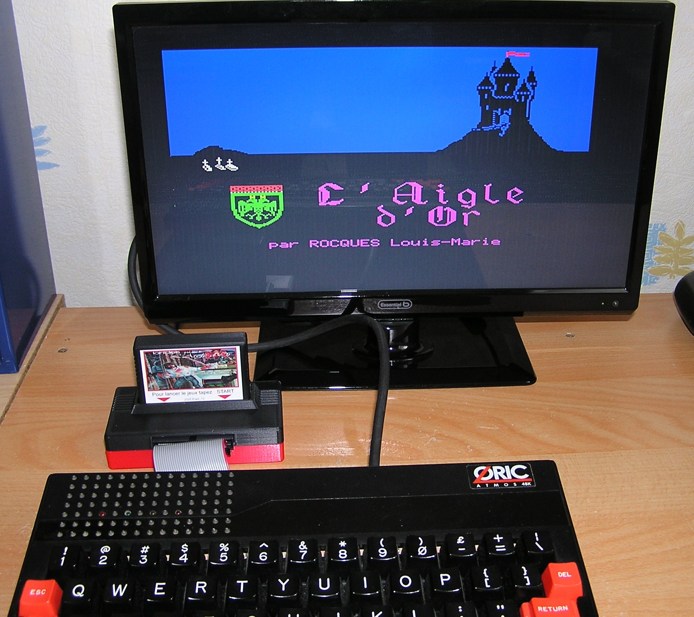
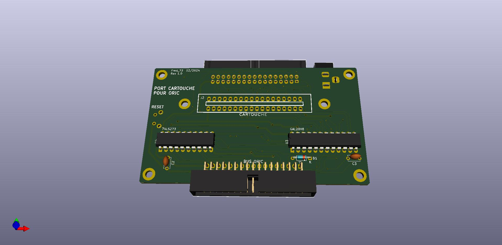

# Extension cartouche pour ORIC #

Cette extension ajoute un port cartouche à l'Oric.

Elle utilise des cartouches ROM de 128Ko à 1Mo. Elle se loge à la place de la ROM interne de l'Oric [$C000-$FFFF]. La cartouche est donc découpée en page de 16Ko (8 à 64 pages).

* Tous les signaux du bus sont tamponnés afin d'éviter d'endommager l'Oric en cas de fausse manoeuvre. Un port d'extension permet de brancher les extensions classiques. Toutefois, les contrôleurs de disques comme Microdisc, LOCI ou l'Erebus sont incompatibles.
* Une prise JACK d'alimentation placée à l'arrière du boîtier permet d'alimenter tout le système à l'aide d'une source 5V (2A). Dans ce cas, il ne faut pas alimenter l'Oric.
* Enfin, un bouton RESET est placé sur le côté gauche du boîtier.

**Utilisation**

L'interface de branche simplement sur le bus d'extension de l'Oric.
*Attention:* Si le boîtier est alimenté (5V/2A), il ne faut pas alimenter l'Oric.

* Sans cartouche, l'Oric démarre normalement sur sa ROM interne.

* Avec une cartouche, la ROM interne de l'Oric est désactivée. Il démarre donc sur la ROM externe avec une version modifiée du BASIC.
Au prompt, il suffit de taper START pour lancer le jeux ou le menu de sélection.

*Attention:* les cartouches se branchent et se débranchent ORIC éteint!
